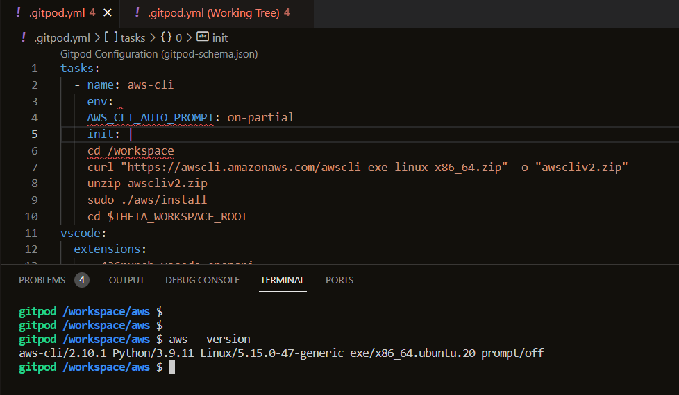
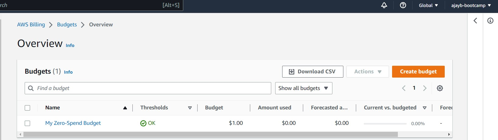
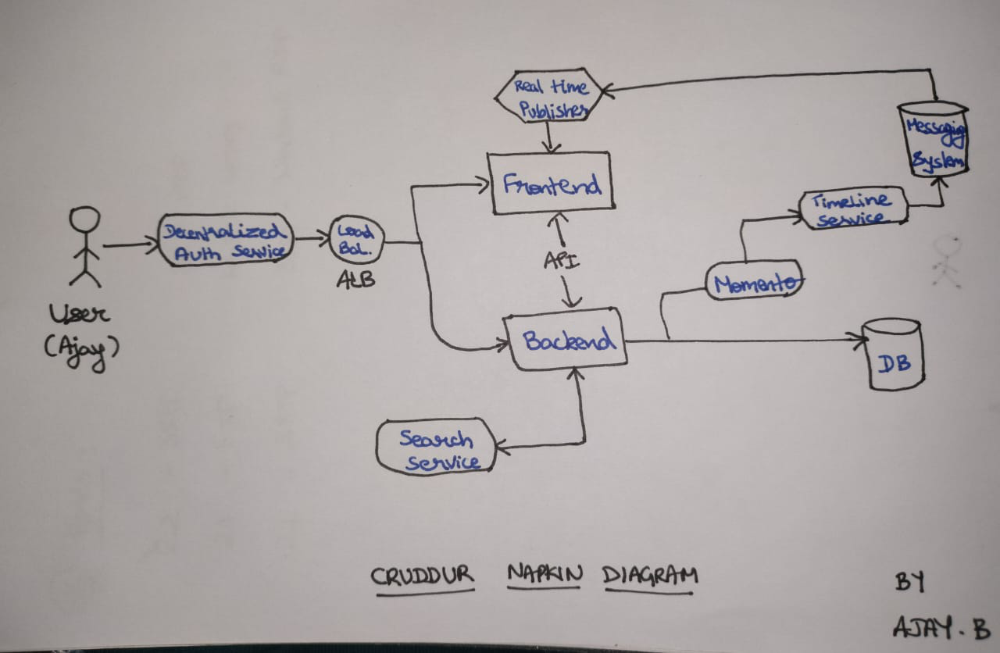
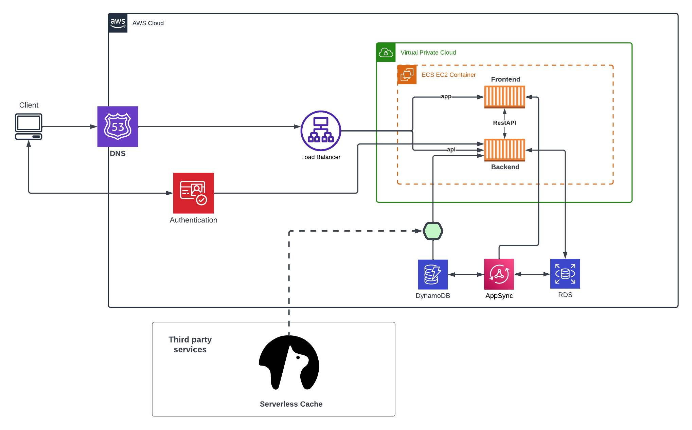

# Week 0 — Billing and Architecture

## Required Homework/Tasks

### Install and Verify AWS CLI 

I was able to install AWS CLI using Gitpod and I've configured it with AWS access keys.



### Create a Budget

I created my own Budget for $1 because I cannot afford any kind of spend.
I did not create a second Budget because I was concerned of budget spending going over the 2 budget free limit.

 

### Recreate Conceptual Diagram on a Napkin



[Lucid Charts Share Link](https://lucid.app/lucidchart/6785a88f-5be2-4843-92c4-6b9056093048/edit?viewport_loc=-809%2C-366%2C2482%2C1117%2C0_0&invitationId=inv_528dee53-34ad-424c-8e39-b9731797eecf)


### Recreate Logical Architectural Deisgn



[Lucid Charts Share Link](https://lucid.app/lucidchart/66b00829-51b5-4e02-8d89-3a8ef84bc9dd/edit?viewport_loc=-716%2C-99%2C2747%2C1236%2C0_0&invitationId=inv_6233e196-b10c-47fe-a7f7-e110ece18ce2)

## Example of Referncing a file in the codebase

Example of me of referencing a file in my repo:
[main/aws/json/alarm-config.json](https://github.com/ajaysrinic/aws-bootcamp-cruddur-2023/blob/main/aws/json/alarm-config.json)

## List Example

- This
- Is 
- A
- List

1. This
2. Is
3. A 
3. Ordered 
4. List

## Table Example

| My | Cool | Table |
| --- | --- | ---|
| Hello | World | ! |

## Code Example

```json
{
    "AlarmName": "DailyEstimatedCharges",
    "AlarmDescription": "This alarm would be triggered if the daily estimated charges exceeds 1$",
    "ActionsEnabled": true,
    "AlarmActions": [
        "arn:aws:sns:us-east-1:065996166618:billing-alarm"
    ],
    "EvaluationPeriods": 1,
    "DatapointsToAlarm": 1,
    "Threshold": 1,
    "ComparisonOperator": "GreaterThanOrEqualToThreshold",
    "TreatMissingData": "breaching",
    "Metrics": [{
        "Id": "m1",
        "MetricStat": {
            "Metric": {
                "Namespace": "AWS/Billing",
                "MetricName": "EstimatedCharges",
                "Dimensions": [{
                    "Name": "Currency",
                    "Value": "USD"
                }]
            },
            "Period": 86400,
            "Stat": "Maximum"
        },
        "ReturnData": false
    },
    {
        "Id": "e1",
        "Expression": "IF(RATE(m1)>0,RATE(m1)*86400,0)",
        "Label": "DailyEstimatedCharges",
        "ReturnData": true
    }]
  }
```
