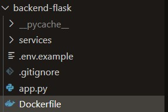
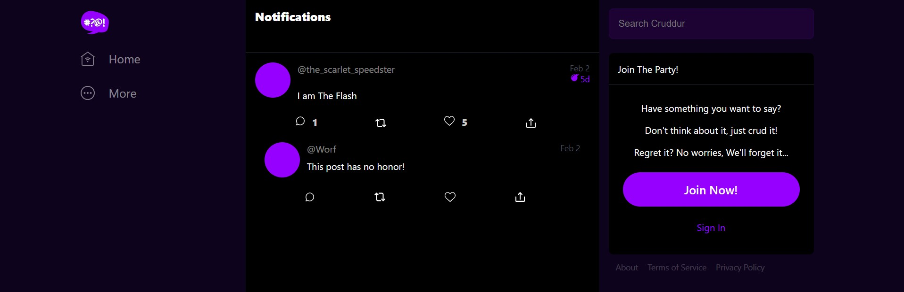
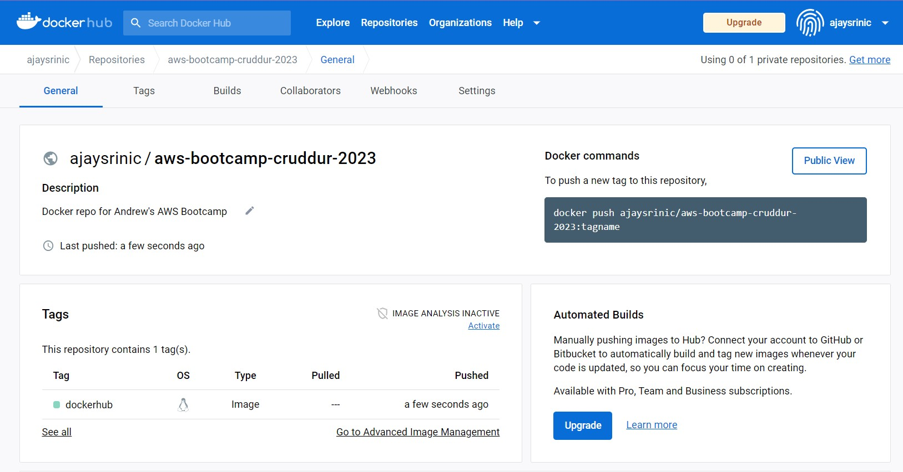
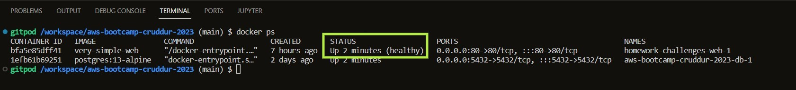
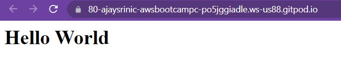
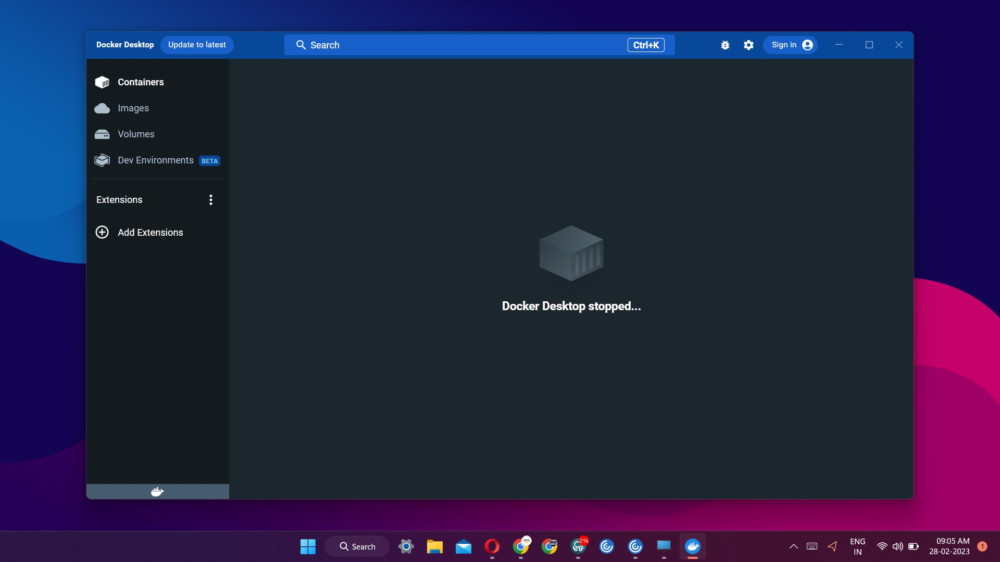
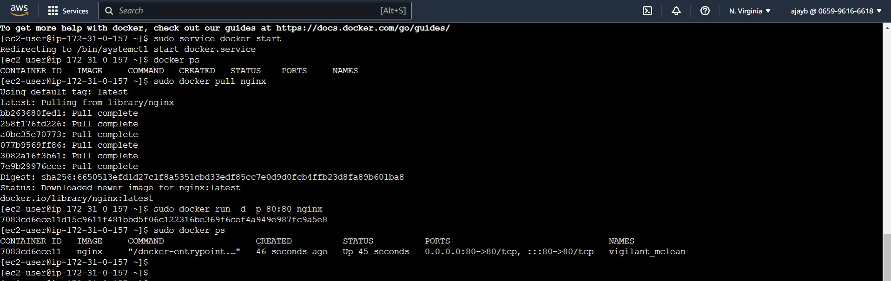

# Week 1 — App Containerization

## Homework Required

## Tasks Completed:
## #1 Built the Cruddur app using Gitpod.
We built an application (**Cruddur**) using Gitpod on a localhost. We used two different files `frontend-react-js` and `backend-flask` which were connected and talking to each other. I also configured the `gitpod.yml` file and the `docker-compose.yml` file, and then we used this cool Docker extension Andrew recommended, to **compose up** to bring up the ports which ran the Cruddur app. The port `4567` was used for backend and the port `3000` was used for frontend.


### Created Dockerfile for `backend-flask`
We wrote a small chunk of code to install and run Flask using Python3. I'm not pasting the whole code here, I felt these were the important stuff.

```
RUN pip3 install -r requirements.txt
CMD [ "python3", "-m" , "flask", "run", "--host=0.0.0.0", "--port=4567"]
```
We also configured the FRONTEND_URL and BACKEND_URL variables.

For the `frontend-react-js` part, we had to create a Dockerfile and do `npm i` to install the **react** dependencies.

### Error fixed: Failed Docker Build
There was a problem when I ran the Docker build command for the above Dockerfile, the Docker daemon wasn't able to fetch the Dockerfile though I was in the same directory. It took me a few minutes to figure out that I named the `Dockerfile` as `DockerFile`.




 ## #2 Notification feature added
 We created a NotificationFeedsPage similar to the HomeFeedsPage and notched up the Cruddur app.
 
 
 
 ## #3 Installed DynamoDB on Gitpod
 Installing DynamoDB was quite easy with AWS pre-installed in the CLI. We just had to run a few queries to create the table and make sure it's working.
 
 We created a table named "Music" and inserted a few records to the table.
 
 To list out the DB records, we used this query:
 ```
 aws dynamodb list-tables --endpoint-url http://localhost:8000
 ```
 
 ## #4 Installed Postgres on Gitpod
 We also installed and ran Postgres on Gitpod. For Postgres, we had to install the Postgres client from the VS code extensions by adding this:
 
 `- cweijan.vscode-postgresql-client2` in our `gitpod.yml` file.
 
 ### Error fixed : Authentication error in Postgres
I was trying to connect to the Postgres client in the terminal, so I used `psql --host localhost` command but for some reason my Gitpod credentials didn't work. I even tried resetting the Github password as it was linked to Gitpod, but still nothing. So I decided to ask help in our Discord channel, it's really nice to see how people help each other as a community. 

The problem was that I was missing a flag in the psql command, `psql -U postgres --host localhost`. Now it worked, we set the default password as `password`.
 
## Homework Challenges
I created a separate folder homework-challenges in my master branch.

### Dockerfile CMD as external script
I created a `script.sh` file and added the  `CMD [ "python3", "-m" , "flask", "run", "--host=0.0.0.0", "--port=4567"]` chunk from our Dockerfile. I ran it from the terminal and it got executed.

### Push image to Docker Hub
I created a new Docker image and pushed it to my Docker Hub repo `ajaysrinic/aws-bootcamp-cruddur-2023` which was set to public access.

* First, I tagged the Docker image using the Docker tag command.
  `docker tag SOURCE_IMAGE[:TAG] TARGET_IMAGE[:TAG]`
* I logged on to my DockerHub account in Gitpod using `docker login` command.
* Once I logged in, I used the `docker push ajaysrinic/aws-bootcamp-cruddur-2023:tagname` command to push my image to the respective repo.


  
### Multi-stage building and Health check in docker-compose file

I followed a Medium article to set up health checkup for docker-compose files. I created 3 different files to host a `Hello World` page in localhost along with health check set up.

* A `docker-compose.health.yml` file with the below script:

```
services:
  web:
    image: very-simple-web
    build:
      context: ./
      dockerfile: Dockerfile
    restart: unless-stopped
    ports:
      - "80:80"
    healthcheck:
      test: curl --fail http://localhost || exit 1
      interval: 60s
      retries: 5
      start_period: 20s
      timeout: 10s
```

* A `Dockerfile` with the below script:
```
FROM nginx
COPY html /usr/share/nginx/html
```
* A `index.html` file:
```
<html>
<head>
    <title>Hello World FTP</title>
</head>
<body>
<h1>Hello World</h1>
</body>
</html>
```
**Output:**




### Installation of Docker in local machine
I followed the Docker documentation to install the Docker application in my local system.
[](https://docs.docker.com/desktop/install/windows-install/)

I downloaded the `Docker Desktop Installer.exe` and then installed it.

Now I have Docker installed in my Windows machine:



### Docker in AWS EC2
I created an EC2 instance `Docker_Challenge_EC2` in my AWS account. I added the below user script while configuring the instance to pre-install Docker:

```
#!/bin/bash
sudo yum update -y
sudo yum install -y docker
sudo service docker start
sudo usermod -a -G docker ec2-user 
```
* After starting the Docker daemon service, I pulled the official Nginx docker image using the `sudo docker pull nginx` command.


