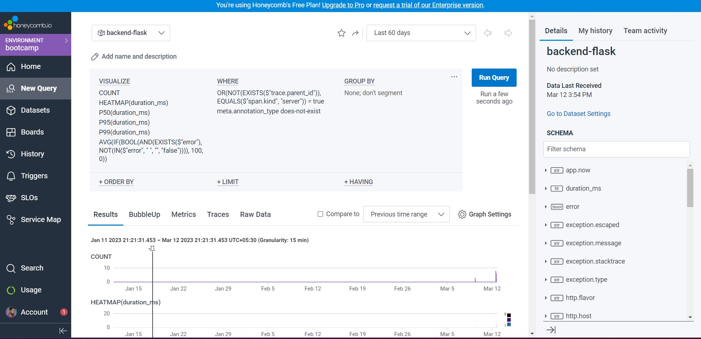
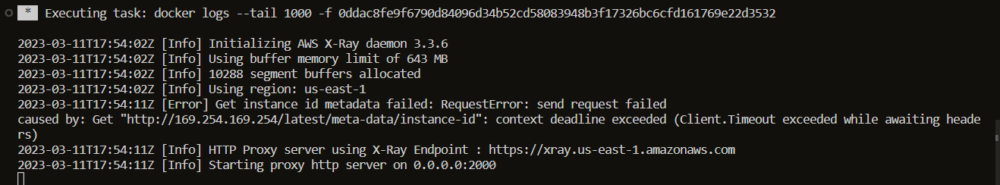
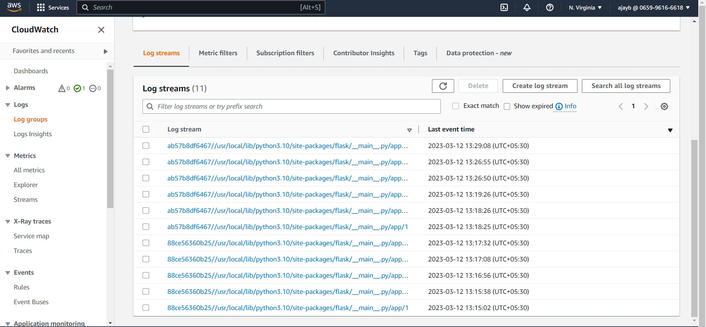
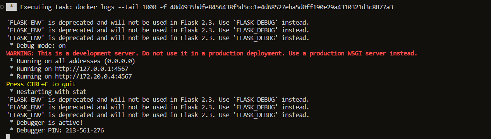
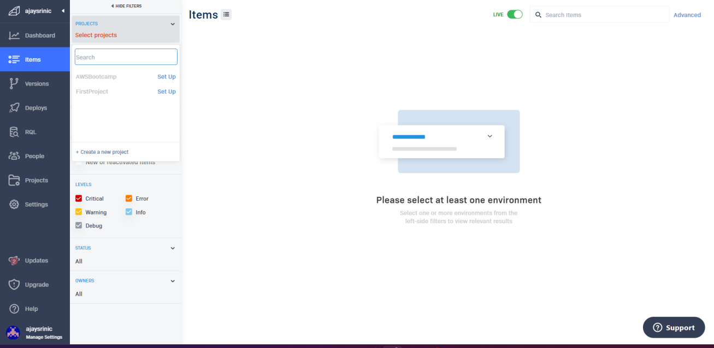
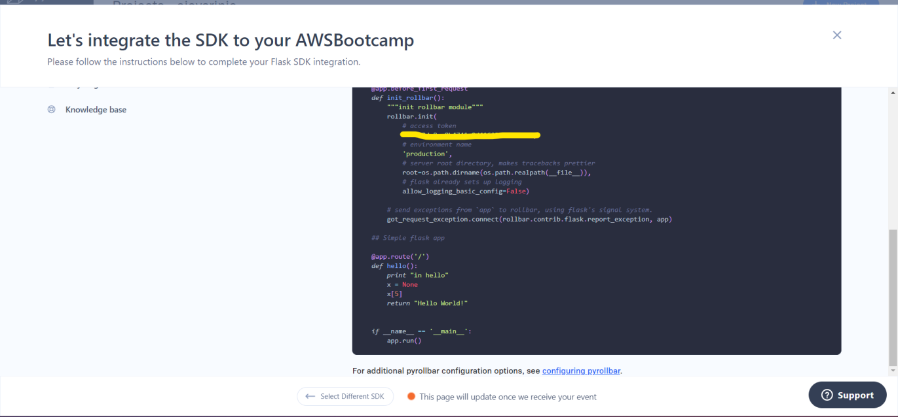
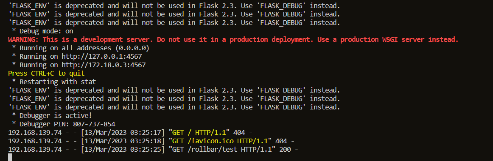
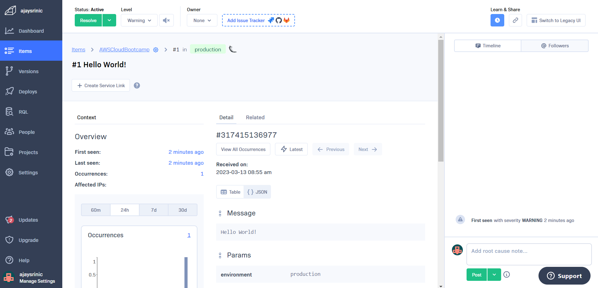

# Week 2 — Distributed Tracing

## Required Homework

## #1 HONEYCOMB 

I created a Honeycomb account and an environment. I used the environment's API Key to connect my Cruddur application data with Honeycomb.
I set the Honeycomb API Key as an environment variable in Gitpod using the below commands

```
export HONEYCOMB_API_KEY="<your API key>"
gp env HONEYCOMB_API_KEY="<your API key>"
```
Declared my API Key in the OTEL variable in the `docker-compose.yml` file:
```
OTEL_SERVICE_NAME: 'backend-flask'
      OTEL_EXPORTER_OTLP_ENDPOINT: "https://api.honeycomb.io"
      OTEL_EXPORTER_OTLP_HEADERS: "x-honeycomb-team=${HONEYCOMB_API_KEY}"
```

I followed the honeycomb documentation for Python and also Jessica's advice on how to run the queries in Honeycomb.
 
 **Trace spans in Honeycomb**



## #2 AWS X-RAY
I integrated AWS X-RAY in our application by following the below steps:

**Installation of aws-xray package**
```
pip install aws-xray-sdk
```
To create our own Sampling Rule named 'Cruddur', the code was present in `aws/json/xray.json` file.
```
{
  "SamplingRule": {
      "RuleName": "Cruddur",
      "ResourceARN": "*",
      "Priority": 9000,
      "FixedRate": 0.1,
      "ReservoirSize": 5,
      "ServiceName": "Cruddur",
      "ServiceType": "*",
      "Host": "*",
      "HTTPMethod": "*",
      "URLPath": "*",
      "Version": 1
  }
}
```
- **To create a new group for tracing and analyzing errors and faults in the Flask application.**
```
FLASK_ADDRESS="https://4567-${GITPOD_WORKSPACE_ID}.${GITPOD_WORKSPACE_CLUSTER_HOST}"
aws xray create-group \
   --group-name "Cruddur" \
   --filter-expression "service(\"$FLASK_ADDRESS\")"
```
The code provided enables monitoring of a Flask service using AWS X-Ray by creating a trace analysis group. This helps developers quickly identify and address issues related to the service.

```
aws xray create-sampling-rule --cli-input-json file://aws/json/xray.json
```
**Installation of AWS X-RAY Daemon Service**
```
 xray-daemon:
    image: "amazon/aws-xray-daemon"
    environment:
      AWS_ACCESS_KEY_ID: "${AWS_ACCESS_KEY_ID}"
      AWS_SECRET_ACCESS_KEY: "${AWS_SECRET_ACCESS_KEY}"
      AWS_REGION: "us-east-1"
    command:
      - "xray -o -b xray-daemon:2000"
    ports:
      - 2000:2000/udp
```
Added Environment Variables in `docker-compose` file :
```
   AWS_XRAY_URL: "*4567-${GITPOD_WORKSPACE_ID}.${GITPOD_WORKSPACE_CLUSTER_HOST}*"
   AWS_XRAY_DAEMON_ADDRESS: "xray-daemon:2000"
```

## X-RAY Error 
Basically, I set up everything as per Andrew's videos but for me the AWS X-RAY daemon wasn't sending out any segments.



Since X-RAY was used as an alternative I'm going to start using Honeycomb for tracing in future, as per Andrew's advice during the Q&A session.

## #3 CloudWatch
To use CloudWatch I installed `watchtower` package using pip. The environment variables were set in `docker-compose.yml` file as usual.

```
      AWS_DEFAULT_REGION: "${AWS_DEFAULT_REGION}"
      AWS_ACCESS_KEY_ID: "${AWS_ACCESS_KEY_ID}"
      AWS_SECRET_ACCESS_KEY: "${AWS_SECRET_ACCESS_KEY}"
```

**Configured LOGGER using the below code**
```
# Configuring Logger to Use CloudWatch
LOGGER = logging.getLogger(__name__)
LOGGER.setLevel(logging.DEBUG)
console_handler = logging.StreamHandler()
cw_handler = watchtower.CloudWatchLogHandler(log_group='cruddur')
LOGGER.addHandler(console_handler)
LOGGER.addHandler(cw_handler)
LOGGER.info("some message")
```
```
@app.after_request
def after_request(response):
    timestamp = strftime('[%Y-%b-%d %H:%M]')
    LOGGER.error('%s %s %s %s %s %s', timestamp, request.remote_addr, request.method, request.scheme, request.full_path, response.status)
    return response
```
Logs were traced by Cloudwatch while working on week-2 homework


## #4 ROLLBAR
Installed `blinker` and `rollbar` packages. Set the environment variables for the Rollbar access token.

```
export ROLLBAR_ACCESS_TOKEN=""
gp env ROLLBAR_ACCESS_TOKEN=""
```
**Initialization code for Rollbar**

```
import rollbar
import rollbar.contrib.flask
from flask import got_request_exception
```
```
rollbar_access_token = os.getenv('ROLLBAR_ACCESS_TOKEN')
@app.before_first_request
def init_rollbar():
    """init rollbar module"""
    rollbar.init(
        # access token
        rollbar_access_token,
        # environment name
        'production',
        # server root directory, makes tracebacks prettier
        root=os.path.dirname(os.path.realpath(__file__)),
        # flask already sets up logging
        allow_logging_basic_config=False)

    # send exceptions from `app` to rollbar, using flask's signal system.
    got_request_exception.connect(rollbar.contrib.flask.report_exception, app)
```
```@app.route('/rollbar/test')
def rollbar_test():
    rollbar.report_message('Hello World!', 'warning')
    return "Hello World!"
```

## Fixed Rollbar Error
I was facing an issue while sending data to my Rollbar account. If you look at the below image, there is no GET request sent to Rollbar(connectivity issue).



At first, I seeked help and tried to solve it but no luck. But later, I noticed that my container was fetching my old access token for some reason. Even though I set the environment variables in Gitpod, it didn't update. 



**Rollback kept waiting for my data**



Finally, I hardcoded the API key and now I'm able to receive data in Rollbar.




## #5 Watched Pricing and Security Consideration Videos

**Pricing** : In Chirag's pricing video, I examined the pricing models of Honeycomb, X-Ray, CloudWatch, and Rollbar. Through this exploration, I learned about the free-tier services offered by Amazon and the monthly capacity they provide. It's worth noting the pricing for these services as it varies by region.

**Security** : I learned about the benefits of Observability and Monitoring tools in regards to our project, including their usefulness for maintaining security and debugging issues.

Attended both the quizzes in Pricing & Security.
