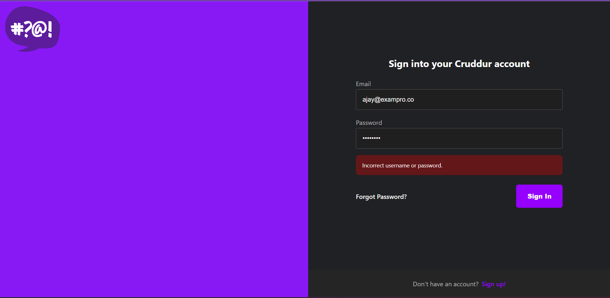
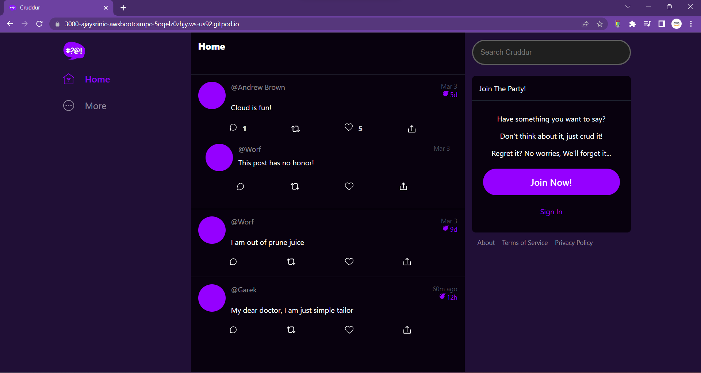

# Week 3 — Decentralized Authentication

# Required Homework
# #1 Live Session - AWS Cognito

During the live session, I created a user pool in AWS Cognito.

**I followed the below steps to setup the UserPool in AWS Cognito**
- Login to your AWS Console
- Check your region in which you want to use your service. I personally prefer `us-east-1` region as in that region most of the services works well.
- Search for **Cognito** service and you will find **UserPool** tab in your left side panel.
- After clicking on **UserPool** -> **Create UserPool**.
- You will get an option to choose the **Authentication providers** page, where I chose **Username** and **Email** for Cognito user pool sign-in option.
- Password Policy was set to **Cognito Default**.
- Under Multi-factor authentication -> I selected **No MFA**.
- In User account recovery -> check **Email only** box.
- Under Required attributes -> I selected **Name** and **preferred username**.
- Then I chose **Send email with Cognito** for first time.
- After the above steps, we need to enter our User Pool name , I gave mine as `crddur-user-pool` -> under Initial app client I kept it as **Public client** -> enter app client name as `cruddur`.
- Review the configurations and create the user pool.

## Gitpod Code Working 
I installed AWS Amplify in the `frontend-react-js` directory. AWS Amplify is a development platform that provides us with a set of pre-built UI components and libraries. 
```
npm i aws-amplify --save
```
This version `"aws-amplify": "^5.0.20"` was installed in my frontend-react-js directory's `package.json` file.


### Configure Amplify
I added the below code in `app.js` of frontend-react-js directory.

```js
import { Amplify } from 'aws-amplify';

Amplify.configure({
  "AWS_PROJECT_REGION": process.env.REACT_AWS_PROJECT_REGION,
  "aws_cognito_identity_pool_id": process.env.REACT_APP_AWS_COGNITO_IDENTITY_POOL_ID,
  "aws_cognito_region": process.env.REACT_APP_AWS_COGNITO_REGION,
  "aws_user_pools_id": process.env.REACT_APP_AWS_USER_POOLS_ID,
  "aws_user_pools_web_client_id": process.env.REACT_APP_CLIENT_ID,
  "oauth": {},
  Auth: {
    // We are not using an Identity Pool
    // identityPoolId: process.env.REACT_APP_IDENTITY_POOL_ID, // REQUIRED - Amazon Cognito Identity Pool ID
    region: process.env.REACT_AWS_PROJECT_REGION,           // REQUIRED - Amazon Cognito Region
    userPoolId: process.env.REACT_APP_AWS_USER_POOLS_ID,         // OPTIONAL - Amazon Cognito User Pool ID
    userPoolWebClientId: process.env.REACT_APP_AWS_USER_POOLS_WEB_CLIENT_ID,   // OPTIONAL - Amazon Cognito Web Client ID (26-char alphanumeric string)
  }
});
```

We need to set the environment variables in `docker-compose.yml`.
```js
REACT_APP_AWS_PROJECT_REGION= ""
REACT_APP_AWS_COGNITO_IDENTITY_POOL_ID= ""
REACT_APP_AWS_COGNITO_REGION= ""
REACT_APP_AWS_USER_POOLS_ID= ""
REACT_APP_CLIENT_ID= ""
```
### I added this code in my `HomeFeedPage.js` to check the **Authentication Process** 

```js
import { Auth } from 'aws-amplify';

// set a state
const [user, setUser] = React.useState(null);

// check if we are authenicated
const checkAuth = async () => {
  Auth.currentAuthenticatedUser({
    // Optional, By default is false. 
    // If set to true, this call will send a 
    // request to Cognito to get the latest user data
    bypassCache: false 
  })
  .then((user) => {
    console.log('user',user);
    return Auth.currentAuthenticatedUser()
  }).then((cognito_user) => {
      setUser({
        display_name: cognito_user.attributes.name,
        handle: cognito_user.attributes.preferred_username
      })
  })
  .catch((err) => console.log(err));
};

  React.useEffect(()=>{
    //prevents double call
    if (dataFetchedRef.current) return;
    dataFetchedRef.current = true;

    loadData();
    checkAuth();
  }, [])
```

### Signin Page, Signout Page and Confirmation Page
Added the below code to handle authentication errors during sign-in.

**Authentication error during sign-in**




**Signin Page**

```js
import { Auth } from 'aws-amplify';

const [cognitoErrors, setCognitoErrors] = React.useState('');

const onsubmit = async (event) => {
  setCognitoErrors('')
  event.preventDefault();
  try {
    Auth.signIn(username, password)
      .then(user => {
        localStorage.setItem("access_token", user.signInUserSession.accessToken.jwtToken)
        window.location.href = "/"
      })
      .catch(err => { console.log('Error!', err) });
  } catch (error) {
    if (error.code == 'UserNotConfirmedException') {
      window.location.href = "/confirm"
    }
    setCognitoErrors(error.message)
  }
  return false
}

let errors;
if (cognitoErrors){
  errors = <div className='errors'>{cognitoErrors}</div>;
}

// just before submit component
{errors}
```

**Signout Page**
```js
import { Auth } from 'aws-amplify';

const [cognitoErrors, setCognitoErrors] = React.useState('');

const onsubmit = async (event) => {
  event.preventDefault();
  setCognitoErrors('')
  try {
      const { user } = await Auth.signUp({
        username: email,
        password: password,
        attributes: {
            name: name,
            email: email,
            preferred_username: username,
        },
        autoSignIn: { // optional - enables auto sign in after user is confirmed
            enabled: true,
        }
      });
      console.log(user);
      window.location.href = `/confirm?email=${email}`
  } catch (error) {
      console.log(error);
      setCognitoErrors(error.message)
  }
  return false
}

let errors;
if (cognitoErrors){
  errors = <div className='errors'>{cognitoErrors}</div>;
}

//before submit component
{errors}
```

**Confirmation Page**
```js
  const resend_code = async (event) => {
    setErrors('')
    try {
      await Auth.resendSignUp(email);
      console.log('code resent successfully');
      setCodeSent(true)
    } catch (err) {
      // does not return a code
      // does cognito always return english
      // for this to be an okay match?
      console.log(err)
      if (err.message == 'Username cannot be empty'){
        setErrors("You need to provide an email in order to send Resend Activiation Code")   
      } else if (err.message == "Username/client id combination not found."){
        setErrors("Email is invalid or cannot be found.")   
      }
    }
  }  

  const onsubmit = async (event) => {
    event.preventDefault();
    setErrors('')
    try {
      await Auth.confirmSignUp(email, code);
      window.location.href = "/"
    } catch (error) {
      setErrors(error.message)
    }
    return false
  }
```

### Recovery Page

```js
  const onsubmit_confirm_code = async (event) => {
    event.preventDefault();
    setErrors('')
    if (password == passwordAgain){
      Auth.forgotPasswordSubmit(username, code, password)
      .then((data) => setFormState('success'))
      .catch((err) => setErrors(err.message) );
    } else {
      setErrors('Passwords do not match')
    }
    return false
  }
```

## #2 Implemented Server side verification using JWT
I gained knowledge about coding for verification, authentication, and authorization through this work. Andrew has chosen to keep it straightforward, condensed, accessible, maintainable, and devoid of complexity. I had to create a user token `JWT(JSON Web Token)` as per the instructions. When a user logs in, this aids in retrieving user information, and if a user logs out, the token is deactivated.

## #3 Understanding AWS Cognito
Amazon Cognito is a service which allows authentication with users that it stores locally in amazon account.

Basically, it is a **user directory** with context of AWS.

**There are 2 types of Amazon Cognito**
- **Cognito User Pool** : Granting access to Application. 
- **Cognito Identity Pool** : Granting access to Amazon services.

## #4 Changed the UI of the Cruddur Application by implementing some CSS.
I made a few tweaks to the UI, I preferred more of a subtle purple color for the background. It matched my Google Chrome theme, lol!



## #5 Security Consideration Video by Ashish Rajan.

Understood the concept of Authentication and Authorization. 
- **SAML (Security Assertion Markup Language)** : You need to have a single point of entry into any application. [uses face ID]
- **Open ID Connect** : Allows you to use your social credentials like Google credentials, LinkedIn, Facebook and so on.. (ONLY Authentication, NO Authorization).

#### For Authorization

- **O Auth** : Usually tag team together with Open ID.

***Real Life Example***

When we post a story in Instagram, it asks us whether we want to share it on Facebook as well?. This workflow essentially is the O Auth and Open ID workflow.
Exchange of token happens at the end.
